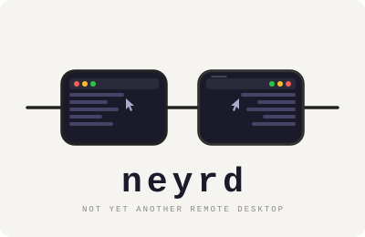

# neyrd

<p align="center">
  
</p>

Low-latency screen streaming over raw TCP. No GPU required. No account. No relay. Just a socket.

*neyrd* loosely translates to "Not Yet Another Remote Desktop". You can call it _nerd_ though.

## Usage

### 1. Download

Grab the latest binaries from the [Releases](../../releases/latest) page:

- `neyrd.emitter` — run on the **host** (the machine you want to stream from)
- `neyrd.receiver` — run on the **client** (the machine you watch on)

Make them executable on Linux:

```sh
chmod +x neyrd.emitter neyrd.receiver
```

### 2. Start the receiver

Run `neyrd.receiver` on the client machine. It will listen on TCP port 22222 and display the stream once the emitter connects.

### 3. Start the emitter

Run `neyrd.emitter` on the host machine, pointing it at the receiver's IP address:

```sh
# Linux (X11)
./neyrd.emitter --receiver-ip <receiver-ip> --adapter X11

# macOS (ScreenCaptureKit)
./neyrd.emitter --receiver-ip <receiver-ip> --adapter ScreenCaptureKit
```

| Flag | Description |
|---|---|
| `--receiver-ip` | IP address of the machine running `neyrd.receiver` |
| `--adapter` | Capture backend: `X11` (Linux) or `ScreenCaptureKit` (macOS) |

## How it works

neyrd has two components:

- **Emitter** — runs on the host machine. Captures frames using native platform APIs, encodes them, and streams over TCP port 22222.
- **Receiver** — runs on the client machine. Receives, decodes, and renders frames in real time.

The connection is bi-directional, enabling input events (pointer, keyboard) to be sent back to the host.

## Requirements

- TCP port 22222 open on both machines
- A reasonably modern CPU — encoding/decoding 30 FPS is compute-intensive and performance will degrade under heavy load

## Platform support

| Role | Platform | Capture backend |
|---|---|---|
| Emitter | macOS | ScreenCaptureKit |
| Emitter | Linux | X11 |
| Receiver | macOS / Linux | Avalonia UI |

## Target performance

- **30 FPS** stable stream
- **~20–50ms** end-to-end latency on LAN

| Stage | Budget |
|---|---|
| Capture → encode | ~5–10ms |
| Network transit | ~5–20ms |
| Decode → display | ~5–10ms |

## What neyrd is not

Not an RDP client. No RDP protocol involved — neyrd uses its own framing over a plain TCP socket.

## Comparison with existing tools

| Tool | Protocol | Latency | Open source | Self-hosted |
|---|---|---|---|---|
| **neyrd** | Raw TCP (custom framing) | ~20–50ms | Yes | Yes |
| RDP | Microsoft RDP | 50–150ms | No | Yes |
| TeamViewer | Proprietary (relay-based) | 100–300ms+ | No | No |
| VNC | RFB | 50–200ms | Yes | Yes |
| Parsec | Proprietary | ~15–30ms | No | No |
| Sunshine/Moonlight | RTSP/custom | ~15–40ms | Yes | Yes |

*Latency figures are approximate end-to-end estimates on LAN and vary by hardware and network conditions.*

**Key differences:**

- **RDP / VNC** — general-purpose protocols with broad feature sets (clipboard, audio, file transfer). neyrd is video-only with minimal overhead and no protocol negotiation complexity.
- **TeamViewer** — traffic is routed through relay servers. neyrd is direct TCP with no third-party involvement and no account required.
- **Parsec** — closest in goals (low-latency streaming), but closed-source, requires an account, and relies on GPU encoding. neyrd works on any CPU-equipped machine.
- **Sunshine/Moonlight** — the strongest open-source alternative, but requires a GPU-capable host (NVIDIA, AMD, or Intel). neyrd is the open-source, self-hosted option that works without one.